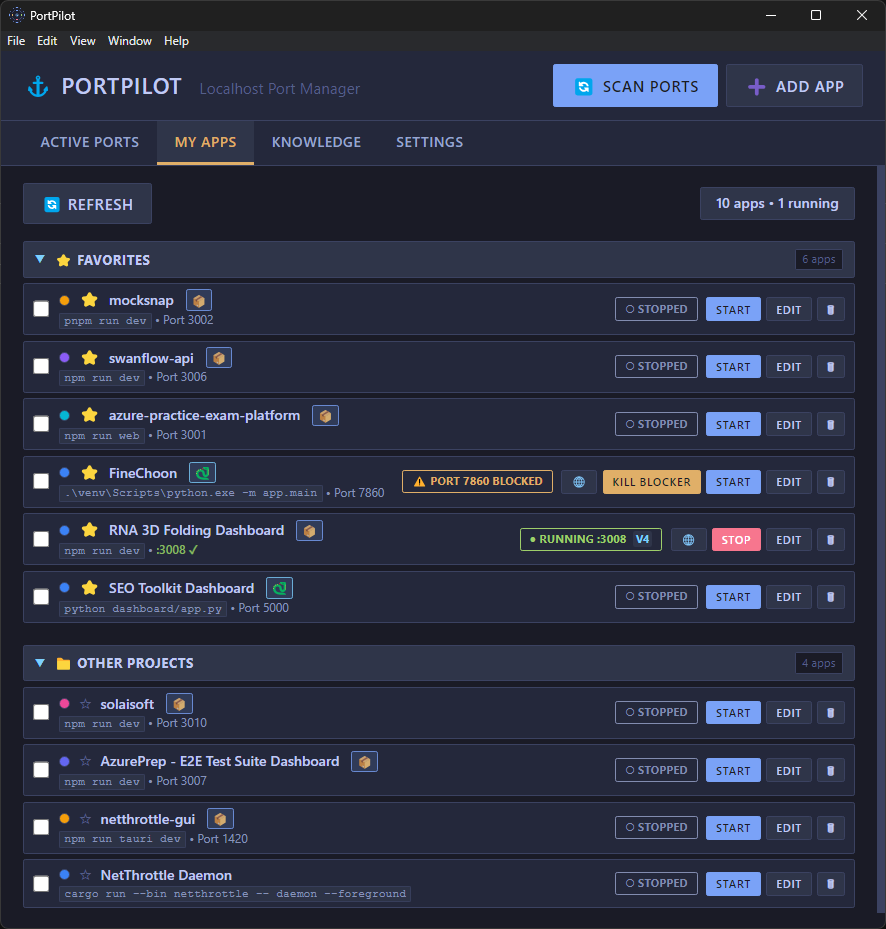
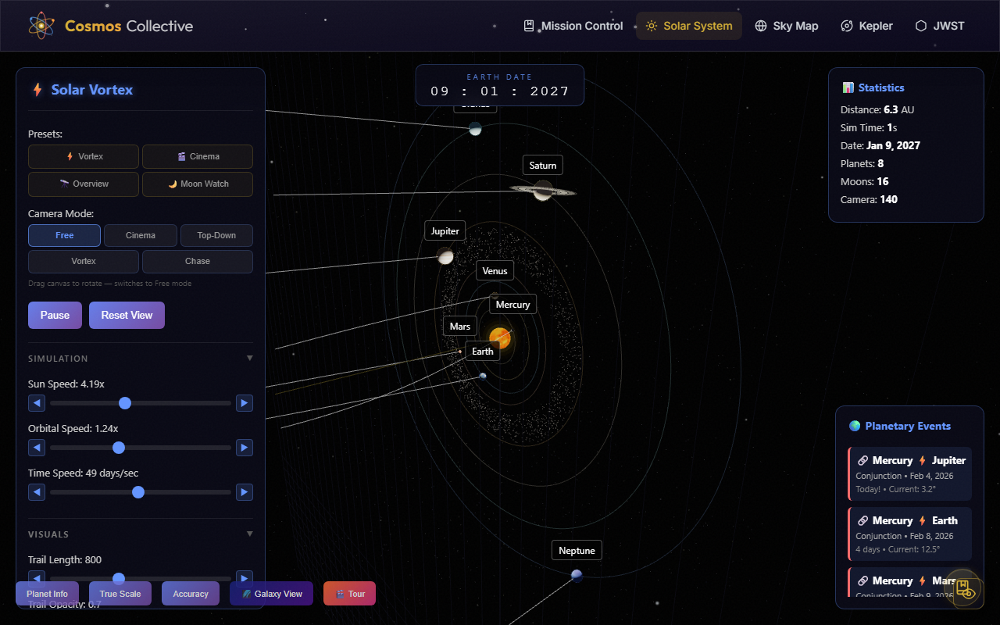
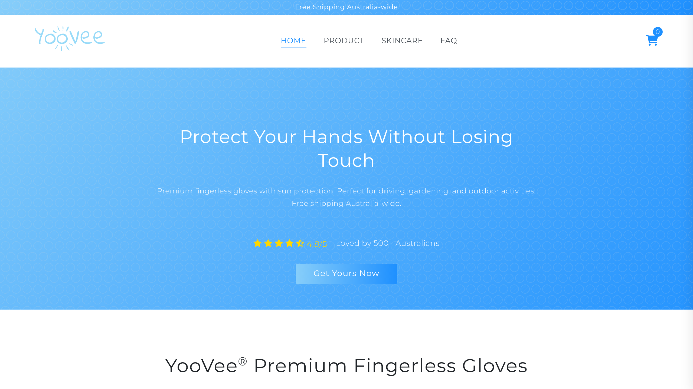

## Hi, I'm Macdara

Full-stack developer creating practical tools across cloud, health tech, AI, and IoT.

---

### Tech

---

### Projects

<table>
  <tr>
    <td width="50%">
      <h4>SwanFlow</h4>
      
      
Real-time Perth traffic monitoring with Edge AI

    </td>
    <td width="50%">
      <h4>PortPilot</h4>
      
      
Localhost Port Manager for Developers

    </td>
  </tr>
  <tr>
    <td width="50%">
      <h4>Cosmos Collective</h4>
      
      
Multi-spectrum astronomical data exploration with citizen science

    </td>
    <td width="50%">
      <h4>Yoovee</h4>
      
      
Skin protection fingerless UV gloves

    </td>
  </tr>
  <tr>
    <td width="50%">
      <h4>Asset Tracker</h4>
      
      
Tool for tracking stock across locations

    </td>
  </tr>
</table>

---

### Contributions

<picture>
  <source media="(prefers-color-scheme: dark)" srcset="https://github.com/m4cd4r4/m4cd4r4/blob/output/github-snake-dark.svg" />
  <source media="(prefers-color-scheme: light)" srcset="https://github.com/m4cd4r4/m4cd4r4/blob/output/github-snake.svg" />
  
</picture>
