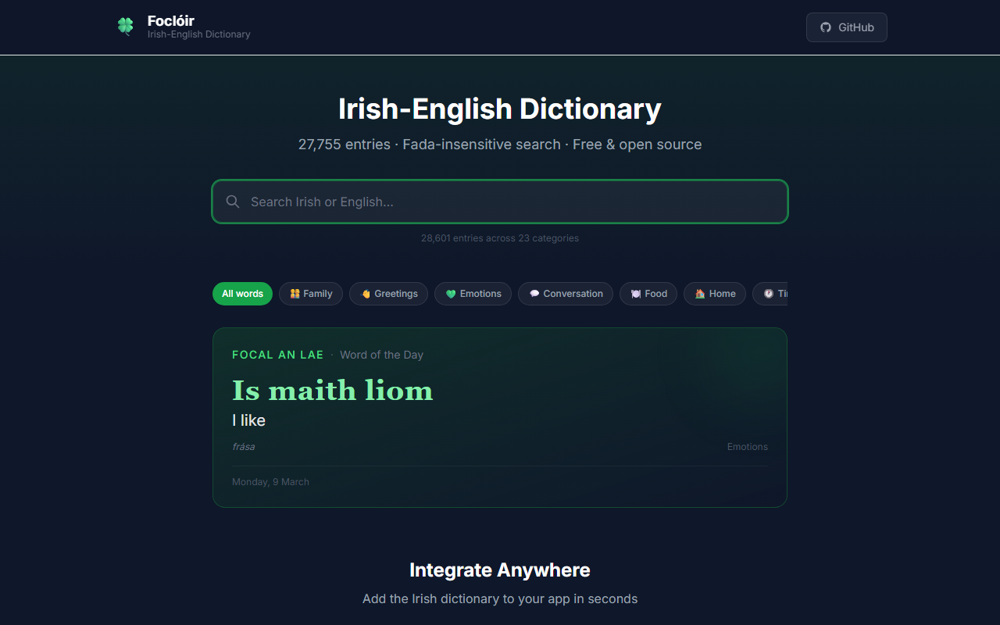

## Hi, I'm Macdara

Full-stack developer building practical tools across AI, health tech, scientific computing, and IoT. Based in Perth, Western Australia.

---

### Tech

---

### Open Source Contributions

Contributor to scientific Python libraries and open-source health platforms.

**Merged**

| Project | PR | Description |
|---------|----|-------------|
| [astropy/astroquery](https://github.com/astropy/astroquery) | [#3551](https://github.com/astropy/astroquery/pull/3551) | Add `raise_for_status()` to NED query methods |
| [ifmeorg/ifme](https://github.com/ifmeorg/ifme) | [#2402](https://github.com/ifmeorg/ifme/pull/2402) | Fix Docker CRLF issues via `.gitattributes` |

**Under review**

| Project | PR | Description |
|---------|----|-------------|
| [lightkurve/lightkurve](https://github.com/lightkurve/lightkurve) | [#1543](https://github.com/lightkurve/lightkurve/pull/1543) | Fix `normalize()` crash with masked flux arrays |
| [astropy/astropy](https://github.com/astropy/astropy) | [#19389](https://github.com/astropy/astropy/pull/19389) | Suppress redundant log when unit matches FITS BUNIT |
| [sunpy/sunpy](https://github.com/sunpy/sunpy) | [#8537](https://github.com/sunpy/sunpy/pull/8537) | Relocate `solar_angular_radius` to `sunpy.coordinates` |
| [astropy/astroplan](https://github.com/astropy/astroplan) | [#636](https://github.com/astropy/astroplan/pull/636) | Replace deprecated `plot_date` with `plot` |
| [spacepy/spacepy](https://github.com/spacepy/spacepy) | [#832](https://github.com/spacepy/spacepy/pull/832) | Fix `parse_filename_time` crash on `_north` filenames |
| [LibreHealthIO/lh-ehr](https://github.com/LibreHealthIO/lh-ehr) | [#1698](https://github.com/LibreHealthIO/lh-ehr/pull/1698) | Fix path traversal and XSS vulnerabilities |
| [ifmeorg/ifme](https://github.com/ifmeorg/ifme) | [#2403](https://github.com/ifmeorg/ifme/pull/2403) | Reduce JS payload by ~300KB (15% reduction) |

---

### Projects

<table>
  <tr>
    <td width="50%">
      <h4>Home Scout</h4>
      
      
Privacy-first home companion robot on Arduino VENTUNO Q - voice, vision, navigation, object memory, face recognition. Zero internet.

    </td>
    <td width="50%">
      <h4>mcpwrap</h4>
      
      
Turn any REST API into an MCP server in 10 seconds - runtime OpenAPI wrapper, zero codegen

    </td>
  </tr>
  <tr>
    <td width="50%">
      <h4>Trutina</h4>
      
      
AI mortgage fraud detection - identifies synthetic payslips and bank statements

    </td>
    <td width="50%">
      <h4>RecStitch</h4>
      
      
Record browser actions and export resilient automation scripts for Playwright, Stagehand, and Browser Use

    </td>
  </tr>
  <tr>
    <td width="50%">
      <h4>Erdos-Straus Gateway</h4>
      
      
Finite algebraic covering system for the Erdos-Straus conjecture - 24 identities cover all primes to 10^9

    </td>
    <td width="50%">
      <h4>Green H2 Catalyst Research</h4>
      
      
ML screening pipeline for earth-abundant acid OER catalysts - iridium-free green hydrogen

    </td>
  </tr>
  <tr>
    <td width="50%">
      <h4>BloodClarity</h4>
      
      
AI-powered blood test analysis - plain English results with 99% accuracy

    </td>
    <td width="50%">
      <h4>BrightClause</h4>
      
      
AI contract analysis - plain English summaries of legal documents

    </td>
  </tr>
  <tr>
    <td width="50%">
      <h4>SwanFlow</h4>
      
      
Edge AI traffic monitoring for Perth - ESP32-CAM, FOMO object detection, interactive map

    </td>
    <td width="50%">
      <h4>Cosmos Collective</h4>
      
      
Multi-spectrum astronomical data exploration with citizen science features

    </td>
  </tr>
  <tr>
    <td width="50%">
      <h4>Asset Tracker</h4>
      
      
Real-time inventory management across multiple locations

    </td>
    <td width="50%">
      <h4>Focloir</h4>
      
      
Irish-English dictionary with 27,755 entries and fada-insensitive search

    </td>
  </tr>
  <tr>
    <td width="50%">
      <h4>FreeDoom HD</h4>
      
      
AI-upscaled 4x texture pack for Freedoom - 2,553 assets enhanced with Real-ESRGAN

    </td>
    <td width="50%">
      <h4>PortPilot</h4>
      
      
Localhost port manager for developers

    </td>
  </tr>
</table>

---

### Stats

  
  

---

### Activity

<picture>
  <source media="(prefers-color-scheme: dark)" srcset="https://github.com/m4cd4r4/m4cd4r4/blob/output/github-snake-dark.svg" />
  <source media="(prefers-color-scheme: light)" srcset="https://github.com/m4cd4r4/m4cd4r4/blob/output/github-snake.svg" />
  
</picture>
