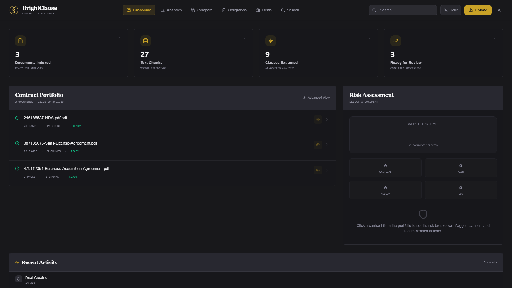
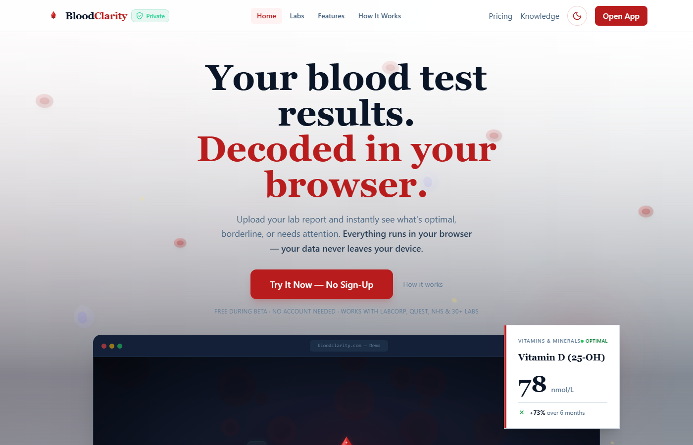
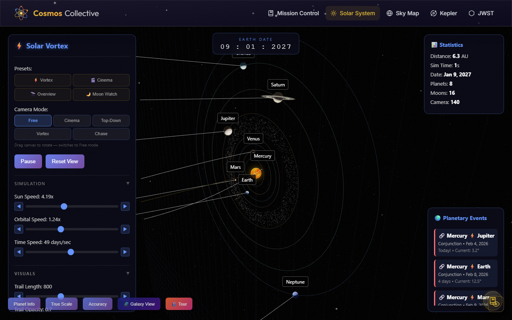

## Hi, I'm Macdara

Full-stack developer.
Currently building tools for cloud certification and health tech.

---

### Tech

---

### Projects

<table>
  <tr>
    <td width="50%">
      <h4>BrightClause</h4>
      
      
AI contract analysis — clause extraction, risk scoring, obligation tracking

    </td>
    <td width="50%">
      <h4>BloodClarity</h4>
      
      
Blood test interpretation with 98.8% biomarker extraction accuracy

    </td>
  </tr>
  <tr>
    <td width="50%">
      <h4>Cosmos Collective</h4>
      
      
3D solar system, JWST imagery, and 2,600+ Kepler exoplanets

    </td>
    <td width="50%">
      <h4>Asset Tracker</h4>
      
      
Real-time inventory management across multiple locations

    </td>
  </tr>
</table>

---

### Stats

  

---

### Contributions

<picture>
  <source media="(prefers-color-scheme: dark)" srcset="https://github.com/m4cd4r4/m4cd4r4/blob/output/github-snake-dark.svg" />
  <source media="(prefers-color-scheme: light)" srcset="https://github.com/m4cd4r4/m4cd4r4/blob/output/github-snake.svg" />
  
</picture>
